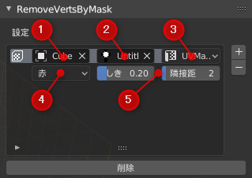

# Remove Verts By Mask

## なにこれ？

マスクテクスチャを使用して頂点を削除する Blender2.8 用アドオンです。

## インストール

zip ファイルをダウンロードして、「編集」「設定」「アドオン」「インストール」を選択し、ダウンロードした zip ファイルをインストールします。

## 使い方

1. 3DビューのUIパネル(標準のキーマップでNキーで開閉できるパネル)のツールから RemoveVertsByMask を開きます
2. 設定の「＋」ボタンを押して設定を追加していきます
3. 「削除」ボタンを押して削除を実行します

## 設定項目

1. オブジェクト: 削除対象のオブジェクト
2. マスク: マスクテクスチャ
3. UVMap: マスクテクスチャと対応するUVMap
4. チャンネル: マスクテクスチャの参照するチャンネル
5. しきい値, 隣接距離: 削除対象の頂点からn回隣接している頂点すべてがしきい値以下なら削除

## ライセンス

[MITライセンス](./LICENSE)

## 連絡先

Twitter: [@Taremin_VR](https://twitter.com/Taremin_VR) までお気軽に連絡ください。
要望や不具合報告などは Issues か Twitter どちらでもお気軽にどうぞ。